# 02 — Arsitektur Aplikasi

## 2.1 Arsitektur High-Level

Aplikasi **eTicketing Helpdesk** menggunakan pola **client-server** dengan Flutter sebagai client dan Supabase (Postgres + Storage) sebagai backend cloud. Pemisahan layer jelas: setiap komponen punya tanggung jawab tunggal sehingga mudah diuji dan dipelihara.

**Prinsip desain:**
- **Single source of truth** — state aplikasi hanya di Provider, UI hanya membaca lewat `Consumer`.
- **Stateless widget** sebanyak mungkin — logika ada di Provider/Service.
- **Repository pattern** — semua panggilan Supabase melewati `SupabaseService` (singleton), bukan langsung dari UI.
- **Optimistic UI** — untuk update ringan, UI update dulu sambil sinkron ke server di background.

```
┌────────────────────────────────────────────────────────┐
│                    FLUTTER APP                          │
│                                                         │
│  ┌──────────┐  ┌──────────┐  ┌──────────┐  ┌─────────┐ │
│  │ Screens  │→ │Providers │→ │ Services │→ │Supabase │ │
│  │ (View)   │  │(ViewModel│  │(Repo)    │  │ Client  │ │
│  └──────────┘  └──────────┘  └──────────┘  └────┬────┘ │
│       ↑                ↑              ↑             │    │
│       └────────────────┴──────────────┘             │    │
│            ChangeNotifier + GoRouter                │    │
└───────────────────────────────────────────────────┼────┘
                                                    │ HTTPS
                                                    ▼
                                          ┌─────────────────┐
                                          │   SUPABASE      │
                                          │  ┌───────────┐  │
                                          │  │PostgreSQL │  │
                                          │  └───────────┘  │
                                          │  ┌───────────┐  │
                                          │  │  Storage  │  │
                                          │  └───────────┘  │
                                          └─────────────────┘
```

**Gambar arsitektur high-level:**

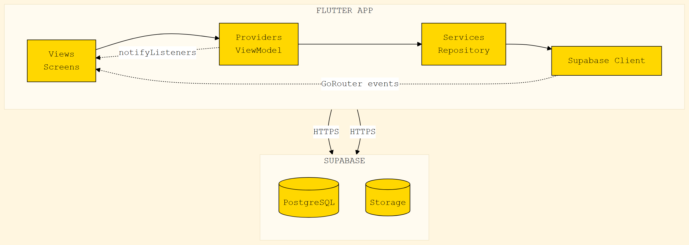

---

**Alur data end-to-end:**
1. User tap tombol / input teks di **Screen** (View).
2. Screen panggil method di **Provider** (ViewModel), mis. `TicketProvider.createTicket()`.
3. Provider bungkus jadi loading state + delegasi ke **Service** (Repository), mis. `SupabaseService.createTicket()`.
4. Service panggil Supabase REST/PostgREST API lewat `supabase_flutter` SDK.
5. Hasil (data atau error) kembalikan ke Provider, lalu Provider `notifyListeners()`.
6. Screen yang pakai `Consumer<...>` otomatis re-build dan tampilkan data baru.
7. Navigasi antar layar dikontrol oleh **GoRouter** dengan path declaratif (`/login`, `/dashboard`, `/tickets/:id`, dll).

**Contoh alur membuat tiket** (detail visual ada di Section 2.5):

```
User tap tombol "Buat Tiket"
  → CreateTicketScreen.onSubmit()
  → TicketProvider.createTicket()
  → SupabaseService.createTicket()      // insert ke tabel tickets
  → SupabaseService.addNotification()   // insert ke tabel notifications
  → setState / notifyListeners() di Provider
  → TicketListScreen otomatis re-build
```

## 2.2 Tech Stack Lengkap

| Layer | Library / Tool | Versi |
|---|---|---|
| Bahasa | Dart | 3.x |
| Framework | Flutter | 3.x stable |
| State | `provider` | ^6.x |
| Routing | `go_router` | ^14.x |
| HTTP/DB | `supabase_flutter` | ^2.x |
| Tema | `google_fonts` | ^6.x |
| Date | `intl` | ^0.19.x |
| UUID | `uuid` | ^4.x |
| Backend | Supabase Cloud (Postgres 15) | - |
| IDE | VS Code + Android Studio | - |

## 2.3 Pola MVVM (Model–View–ViewModel)

| Layer | Implementasi di Proyek Ini |
|---|---|
| **Model** | `lib/data/models/*.dart` — `UserModel`, `TicketModel`, `NotificationModel`, `CommentModel`, `HistoryModel`, `AttachmentModel` |
| **View** | `lib/presentation/screens/**/*.dart` — `LoginScreen`, `DashboardScreen`, `TicketListScreen`, dll. |
| **ViewModel** | `lib/presentation/providers/*.dart` — `AuthProvider`, `TicketProvider`, `ThemeProvider` |
| **Service / Repository** | `lib/services/supabase_service.dart` — `SupabaseService` (singleton) |

**Contoh alur membuat tiket** (version ringkas — diagram visual lengkap di Section 2.5):

```
User tap tombol "Buat Tiket"
  → CreateTicketScreen.onSubmit()
  → TicketProvider.createTicket()
  → SupabaseService.createTicket()      // insert ke tabel tickets
  → SupabaseService.addNotification()   // insert ke tabel notifications
  → setState / notifyListeners() di Provider
  → TicketListScreen otomatis re-build
```

**MVVM Sequence Diagram:**

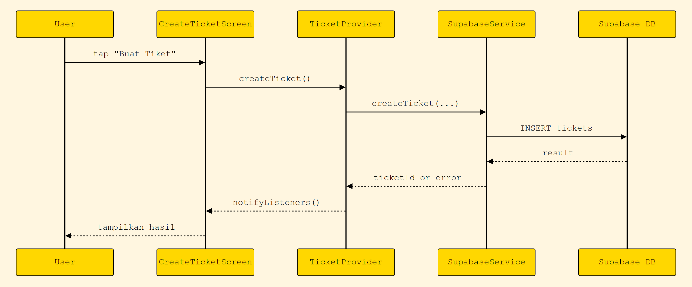

**Penjelasan detail per langkah:**

| # | Aktor / Komponen | Aksi |
|---|---|---|
| 1 | **User** | Tap tombol "+ Buat Tiket" di Ticket List atau Dashboard FAB |
| 2 | `CreateTicketScreen` | Tampilkan form kosong; field wajib: judul (min 5 char), kategori (dropdown), prioritas (chip group), deskripsi (min 10 char, max 500) |
| 3 | `CreateTicketScreen` | Saat tap "SUBMIT", jalankan `Form.validate()`. Jika gagal → tampilkan error merah di field invalid; **proses berhenti** |
| 4 | `CreateTicketScreen` | Tampilkan `CircularProgressIndicator` overlay (loading state) |
| 5 | `CreateTicketScreen` | Panggil `TicketProvider.createTicket(title, description, category, priority, createdBy, attachments)` |
| 6 | `TicketProvider` | Generate id baru: `final newId = 'T-${DateTime.now().millisecondsSinceEpoch}'` (lihat `ticket_provider.dart:86`) |
| 7 | `TicketProvider` | Panggil `_service.createTicket(...)` → jika ada attachment loop `await _service.uploadAttachment(...)` per file → `_service.addNotification(...)`. Semua step berurutan dengan `await` (bukan fire-and-forget) |
| 8 | `SupabaseService` | Kirim `INSERT INTO tickets (...)` ke PostgREST `/rest/v1/tickets`, lalu `INSERT INTO ticket_history` (status=open, note='Tiket dibuat'). Optimistic: tidak pakai transaction |
| 9 | `TicketProvider` | INSERT ke `notifications` lewat `_service.addNotification(...)` dengan pesan universal "Tiket baru X telah dibuat dan menunggu penanganan" (tidak ada scope khusus helpdesk) |
| 10 | `SupabaseService` | Jika Sukses → return `void`. Jika gagal → throw `Exception` dengan pesan DB |
| 11 | `TicketProvider` | Tangkap error; jika ada, tampilkan SnackBar merah dengan pesan. Partial insert dimungkinkan karena tidak ada transaction |
| 12 | `TicketProvider` | Set `_isLoading = false`; `notifyListeners()` |
| 13 | `TicketProvider` | Panggil `loadTicketsForUser(createdBy)` untuk refresh list tiket milik user |
| 14 | `CreateTicketScreen` | Tutup loading overlay, SnackBar hijau "Tiket berhasil dibuat", `Navigator.pop()` |
| 15 | User + UI | Kembali ke Ticket List screen; list sudah punya entry baru di posisi paling atas (sort `updated_at DESC`) |

Kalau ada attachment file: pada langkah #7 (setelah INSERT `tickets`), loop `await _service.uploadAttachment(...)` untuk setiap file. Provider mengirim `fileName: 'attachment_$i.jpg'` (nama file di-generate di sisi Provider), lalu `_service.uploadAttachment` membangun path storage lengkap sebagai `attachments/<ticketId>/<millisecondsSinceEpoch>_<fileName>` (lihat `lib/services/supabase_service.dart:263`).

## 2.4 Flow Diagram — Login

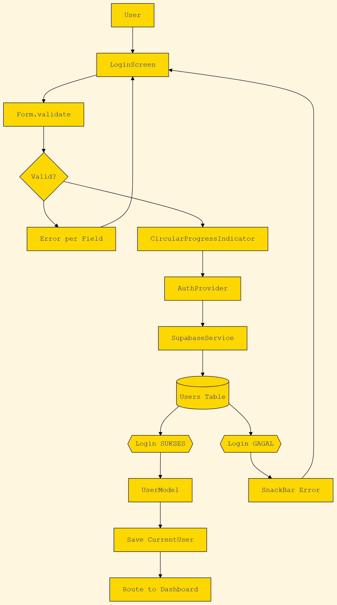

**Catatan:** diagram ini menunjukkan alur autentikasi yang dipakai aplikasi sekarang: login dicek ke tabel `users` di Supabase, lalu jika valid user diarahkan ke dashboard sesuai route `GoRouter`.

## 2.5 Flow Diagram — Buat Tiket

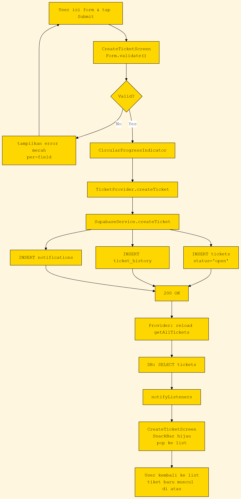

```
ACTOR         CREATE SCREEN     TICKET PROVIDER      SUPABASE SVC       SUPABASE DB
  │                │                  │                    │                  │
  │ isi form, tap  │                  │                    │                  │
  │ "Submit"       │                  │                    │                  │
  │───────────────>                  │                    │                  │
  │                │ Form.validate()  │                    │                  │
  │                │ (judul, kategori,│                   │                  │
  │                │ prioritas, desc) │                   │                  │
  │                ╠══════════════════╧════════════════════╧══════════════════╗
  │                ║   ALT: hasil validasi                                ║
  │                ║   ┌─ VALID ───────────────────────────────────────┐  ║
  │                ║   │ createTicket(...)                            │  ║
  │                ║   │────────────────>                            │  ║
  │                ║   │                 createTicket(...)           │  ║
  │                ║   │                 │────────────────>        │  ║
  │                ║   │                 │   ┌────────────────┐   │  ║
  │                ║   │                 │   │ INSERT INTO    │   │  ║
  │                ║   │                 │   │ tickets (T-…, │   │  ║
  │                ║   │                 │   │ status='open')│   │  ║
  │                ║   │                 │   │───────────────>│   │  ║
  │                ║   │                 │   │ INSERT INTO    │   │  ║
  │                ║   │                 │   │ ticket_history │   │  ║
  │                ║   │                 │   │ status='open'  │   │  ║
  │                ║   │                 │   │───────────────>│   │  ║
  │                ║   │                 │   │ INSERT INTO    │   │  ║
  │                ║   │                 │   │ notifications  │   │  ║
  │                ║   │                 │   │───────────────>│   │  ║
  │                ║   │                 │   └────────────────┘   │  ║
  │                ║   │                 │   ok                   │  ║
  │                ║   │                 │<────────────────        │  ║
  │                ║   │                 │ reload getAllTickets() │  ║
  │                ║   │                 │──┐                    │  ║
  │                ║   │                 │  │ getAllTickets()    │  ║
  │                ║   │                 │<─┘                    │  ║
  │                ║   │                 │ notifyListeners()     │  ║
  │                ║   │                 │──────────────────────────>│ CreateScreen rebuild
  │                ║   │ Navigator.pop()│                       │  ║
  │                ║   │<────────────────────────                  │  ║
  │                ║   │ kembali ke list, SnackBar "Tiket dibuat"│  ║
  │                ║   │──────────────────────────────────────>  │──║──> User
  │                ║   └─────────────────────────────────────────┘  ║
  │                ║   ┌─ TIDAK VALID ────────────────────────────┐  ║
  │                ║   │ tampilkan error merah per-field         │  ║
  │                ║   │ Form tetap terbuka                      │  ║
  │                ║   │──────────────────────────────────────>  │──║──> User
  │                ║   └─────────────────────────────────────────┘  ║
  │                ╚═══════════════════════════════════════════════════╝
```

**3 INSERT terjadi** dalam satu request `createTicket` ke `SupabaseService`:
1. `tickets` — data tiket baru
2. `ticket_history` — audit "Tiket dibuat" dengan status `open`
3. `notifications` — broadcast ke user/helpdesk bahwa ada tiket baru

## 2.6 Flow Diagram — Ubah Status Tiket (Helpdesk)

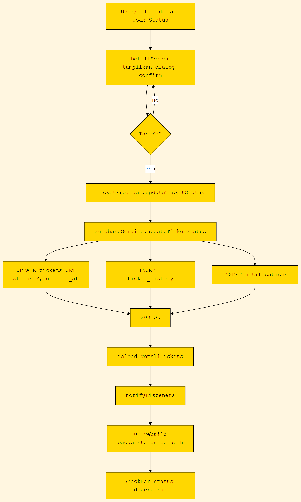

```
ACTOR         DETAIL SCREEN     TICKET PROVIDER     SUPABASE SVC        SUPABASE DB
  │                │                 │                  │                   │
  │ tap "Ubah     │                 │                  │                   │
  │ Status" →     │                 │                  │                   │
  │ pilih status  │                 │                  │                   │
  │──────────────>│                 │                  │                   │
  │                │ dialog confirm │                  │                   │
  │                │ tampilkan      │                  │                   │
  │                │<────────────── │                  │                   │
  │ tap "Ya"      │                 │                  │                   │
  │──────────────>│                 │                  │                   │
  │                │ updateTicketStatus(id, st, note) │                   │
  │                │────────────────>                  │                   │
  │                │                 │ updateTicketStatus(...)            │
  │                │                 │────────────────>                   │
  │                │                 │   ┌──────────────────────┐        │
  │                │                 │   │ UPDATE tickets SET    │        │
  │                │                 │   │ status=?, updated_at=NOW()│     │
  │                │                 │   │─────────────────────────────> │
  │                │                 │   │ INSERT INTO          │        │
  │                │                 │   │ ticket_history       │        │
  │                │                 │   │ (status, note)       │        │
  │                │                 │   │─────────────────────────────> │
  │                │                 │   │ INSERT INTO          │        │
  │                │                 │   │ notifications(title, │        │
  │                │                 │   │   msg, ticket_id)    │        │
  │                │                 │   │─────────────────────────────> │
  │                │                 │   └──────────────────────┘        │
  │                │                 │   ok                             │
  │                │                 │<─────────────────────────────────│
  │                │                 │ reload getAllTickets()           │
  │                │                 │──┐                               │
  │                │                 │<─┘                               │
  │                │                 │ notifyListeners()                │
  │                │<─────────────────                                   │
  │                │ rebuild UI (badge status baru, history baru)       │
  │<──────────────│                                                     │
  │ "Status       │                                                     │
  │  diperbarui"  │                                                     │
```

## 2.7 Flow Diagram — Notifikasi

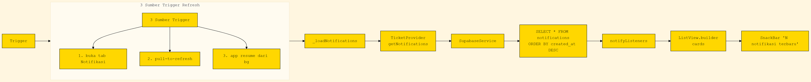

```
TRIGGER        NOTIF SCREEN      TICKET PROVIDER     SUPABASE SVC      SUPABASE DB
  │                │                 │                  │                │
  │ ┌─ 3 SUMBER TRIGGER REFRESH ─────────────────────────────────────────┐│
  │ │                                                                     ││
  │ │  ① buka tab "Notifikasi"      → initState() → _loadNotifications() ││
  │ │  ② pull-to-refresh            → RefreshIndicator() callback       ││
  │ │  ③ app resume dari background → didChangeAppLifecycleState(resumed) ││
  │ │                                                                     ││
  │ └─────────────────────────────────────────────────────────────────────┘│
  │                │                 │                  │                │
  │ tap tab, swipe,│                 │                  │                │
  │ atau resume    │                 │                  │                │
  │──────────────>│                 │                  │                │
  │                │ _loadNotifications()               │                │
  │                │────────────────>                  │                │
  │                │                 │ getNotifications()               │
  │                │                 │────────────────>                  │
  │                │                 │                  │ SELECT * FROM  │
  │                │                 │                  │ notifications  │
  │                │                 │                  │ ORDER BY       │
  │                │                 │                  │ created_at DESC│
  │                │                 │                  │────────────────>│
  │                │                 │                  │<──────────────│
  │                │                 │ List<NotificationModel>           │
  │                │                 │<────────────────│                 │
  │                │                 │ notifyListeners()│                │
  │                │<────────────────                   │                │
  │                │ ListView.builder(cards)            │                │
  │                │──┐                                │                │
  │                │<─┘                                │                │
  │<──────────────│                                    │                │
  │ "12 notifikasi│                                    │                │
  │  terbaru"     │                                    │                │

SIDE NOTE:
  • Tap "centang semua" di appbar → PATCH notifications?is_read=eq.false SET is_read=true
  • Tap salah satu notifikasi → context.push('/tickets/<id>')
```

## 2.8 Struktur Folder Proyek

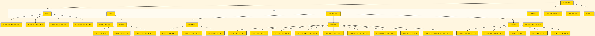

```
eTicketing/
├── lib/
│   ├── main.dart                          # Entry point
│   ├── core/
│   │   ├── router/app_router.dart         # GoRouter config
│   │   ├── supabase_config.dart           # URL + anon key
│   │   ├── theme/app_theme.dart           # Material + brutalist style
│   │   └── utils/validators.dart          # Form validators
│   ├── data/
│   │   ├── dummy/dummy_data.dart          # Data fallback (offline)
│   │   └── models/
│   │       ├── user_model.dart
│   │       ├── ticket_model.dart
│   │       └── notification_model.dart
│   ├── presentation/
│   │   ├── providers/
│   │   │   ├── auth_provider.dart
│   │   │   ├── ticket_provider.dart
│   │   │   └── theme_provider.dart
│   │   ├── screens/
│   │   │   ├── splash_screen.dart
│   │   │   ├── login_screen.dart
│   │   │   ├── register_screen.dart
│   │   │   ├── reset_password_screen.dart
│   │   │   ├── main_shell.dart            # Bottom nav wrapper
│   │   │   ├── dashboard/
│   │   │   │   └── dashboard_screen.dart
│   │   │   ├── tickets/
│   │   │   │   ├── ticket_list_screen.dart
│   │   │   │   ├── ticket_detail_screen.dart
│   │   │   │   └── create_ticket_screen.dart
│   │   │   ├── notification_screen.dart
│   │   │   ├── profile_screen.dart
│   │   │   └── admin/
│   │   │       └── user_management_screen.dart
│   │   └── widgets/
│   │       ├── ticket_card_widget.dart
│   │       ├── status_badge_widget.dart
│   │       ├── empty_widget.dart
│   │       ├── error_widget.dart
│   │       └── loading_widget.dart
│   └── services/
│       └── supabase_service.dart          # Semua call Supabase
├── database_setup.sql                     # Schema + seed
├── pubspec.yaml                           # Dependencies
└── laporan/                               # 📁 Laporan UAS (folder ini)
```

## 2.9 Routing (GoRouter)

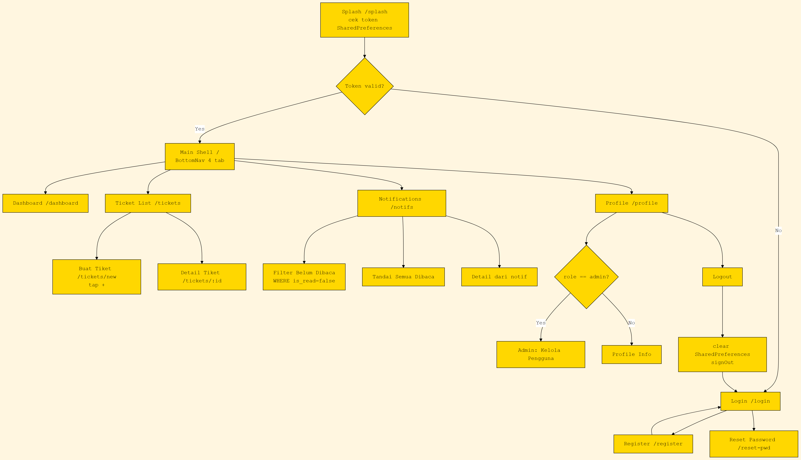

```
┌──────────────┐
│   SPLASH     │ cek token SharedPreferences
│ /splash      │
└──────┬───────┘
       │
       ├─── token tidak ada / expired ───> [ LOGIN ]
       │                                  │ /login
       │                                  │
       └─── token valid ─────────────────> [ MAIN SHELL ]
                                          │ /  (BottomNav: 4 tab)
                                          │
       ┌──────────────────────────────────┴──────────────────────────────┐
       │                                                                  │
       ▼                  ▼                  ▼                  ▼
┌─────────────┐  ┌─────────────┐  ┌─────────────┐  ┌─────────────┐
│ DASHBOARD   │  │ TICKET LIST │  │ NOTIFIKASI  │  │ PROFILE     │
│ /dashboard  │  │ /tickets    │  │ /notifs     │  │ /profile    │
└─────────────┘  └──────┬──────┘  └──────┬──────┘  └──────┬──────┘
                        │                │                │
                        │                │                │ (jika role=admin)
                        │                │ tap notif      │ AdminTile tap
                        │                │                │
                        ▼                ▼                ▼
                  ┌──────────┐    ┌──────────┐    ┌──────────────┐
                  │ BUAT     │    │ DETAIL   │    │ KELOLA       │
                  │ TIKET    │    │ TIKET    │    │ PENGGUNA     │
                  │ /tickets │    │ /tickets │    │ /admin/users │
                  │   /new   │    │   /:id   │    └──────────────┘
                  └──────────┘    └──────────┘
                        ▲
                        │ tap "+"
                        │
                  ┌──────────┐
                  │ LOGIN    │────────────┬──────────────┐
                  │ /login   │            ▼              ▼
                  └────┬─────┘     ┌──────────┐    ┌──────────────┐
                       │ tap      │ REGISTER │    │ RESET        │
                       │ "Daftar" │ /register│    │ PASSWORD     │
                       └─────────>└──────────┘    │ /reset-pwd   │
                                                   └──────────────┘
```

**Aturan navigasi:**
- Bottom-nav tab menggunakan `StatefulShellRoute` (state tab tetap saat ganti tab)
- `/tickets/:id` di-push (bukan replace), sehingga back button kembali ke list
- `/admin/users` di-redirect ke `/login` jika user.role !== 'admin' (di `app_router.dart`)

| Route | File | Syarat |
|---|---|---|
| `/splash` | `splash_screen.dart` | - |
| `/login` | `login_screen.dart` | belum login |
| `/register` | `register_screen.dart` | - |
| `/reset-password` | `reset_password_screen.dart` | - |
| `/` (shell) | `main_shell.dart` | sudah login |
| `/dashboard` | `dashboard_screen.dart` | shell tab 1 |
| `/tickets` | `ticket_list_screen.dart` | shell tab 2 |
| `/tickets/new` | `create_ticket_screen.dart` | user+ |
| `/tickets/:id` | `ticket_detail_screen.dart` | semua role |
| `/notifications` | `notification_screen.dart` | shell tab 3 |
| `/profile` | `profile_screen.dart` | shell tab 4 |
| `/admin/users` | `user_management_screen.dart` | role=admin |

## 2.10 Lifecycle Aplikasi

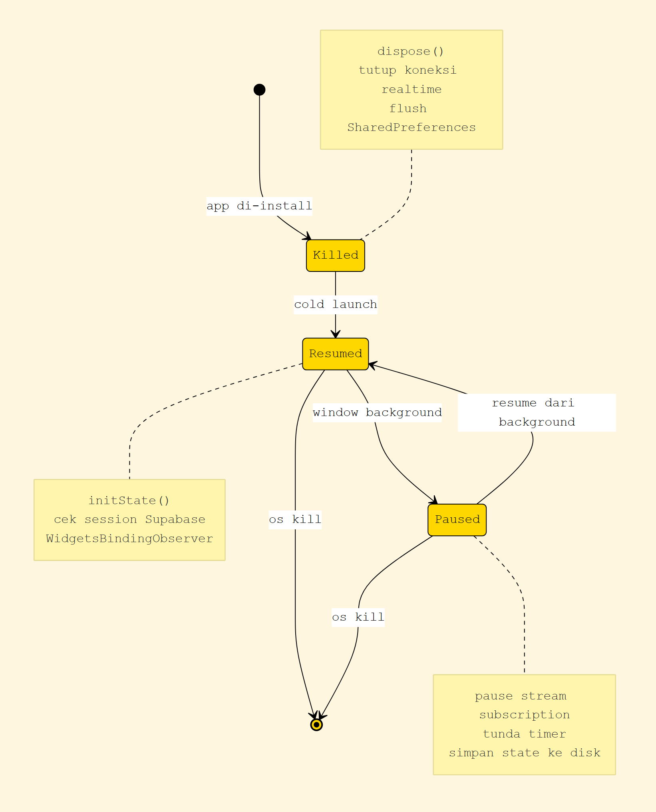

Lifecycle aplikasi mengikuti pola **cold launch → warm resume → terminate** ala Android/iOS modern. Setiap state punya handler yang jelas agar tidak ada memory leak atau state stale.

**State diagram lifecycle:**

```
┌─────────────┐     cold launch    ┌─────────────┐
│   KILLED    │───────────────────→│   RESUMED   │◀──┐
│ (terminated)│   (app di-tap)     │ (foreground)│   │ resume dari background
└──────┬──────┘                    └──────┬──────┘   │
       │                                  │          │
       │ os kill / swipe up               │ window   │
       │ (low memory)                     │ background│
       │                                  ▼          │
       │                            ┌─────────────┐  │
       │                            │   PAUSED    │  │
       │                            │  (inactive) │──┘
       │                            └──────┬──────┘
       │                                   │
       │                                   │ os kill
       └───────────────────────────────────┘
              (5+ menit di background, low memory)
```

**Handler di setiap state (Flutter `WidgetsBindingObserver`):**

| State | Method yang dipanggil | Aksi aplikasi |
|---|---|---|
| `resumed` | (auto) | Inisialisasi Supabase (kalau pertama kali), cek session |
| `inactive` | `AppLifecycleState.inactive` | (no-op untuk UAS) |
| `paused` | (background) | Tunda timer; pause stream subscription |
| `detached` | `deactivate()` / `dispose()` | Tutup koneksi realtime Supabase, flush SharedPreferences |

**Detail alur lifecycle pada aplikasi ini:**

```
  App di-launch dari ikon
       │
       ▼
  ┌──────────┐    cek SharedPreferences
  │  SPLASH  │──── (token + role tersimpan?)
  │  (2 dtk) │         │              │
  └────┬─────┘    Ya: ↓         Tidak: ↓
       │           │               │
       │     ┌─────────────┐ ┌────────────┐
       │     │ MAIN SHELL  │ │   LOGIN    │
       │     │ (BottomNav) │ │   SCREEN   │
       │     └──────┬──────┘ └──────┬─────┘
       │            │               │ tap Register →
       │            │               └→ RegisterScreen → back to Login
       │            │
       │   ┌────────┼─────────────────────────────────────┐
       │   ▼        ▼                ▼                  ▼
       │ Dashboard  TicketList    Notification        Profile
       │  (tab 1)   (tab 2)        (tab 3)            (tab 4)
       │   │           │              │                  │
       │   │        tap tiket         │ tap filter       │ tap Logout
       │   │           ▼              │ "Belum Dibaca"   │
       │   │       TicketDetail       │ → query WHERE    │
       │   │           │              │ is_read=false    │
       │   │        tap "+"           │ tap ✓ tandai     │
       │   │           ▼              │ semua dibaca     │
       │   │       CreateTicket       │ tap notif →      │
       │   │           │              │ TicketDetail +   │
       │   │        submit →          │ mark is_read     │
       │   │        SnackBar +        │ =true            │
       │   │        pop ke list       │                  │
       │   │                          │                  │
       │   └───── tap BottomNav untuk pindah tab ────────┘
       │
       │  App di-pause / masuk background (tombol Home)
       ▼
  ┌─────────────────────────────┐
  │   PAUSED (background)        │
  │   ─ jangan fetch data baru   │
  │   ─ pause stream listener    │
  │   ─ simpan state ke disk     │
  └────────────┬─────────────────┘
               │ tap ikon app / dari recent apps
               ▼
  ┌─────────────────────────────┐
  │   RESUMED (foreground)       │
  │   ─ onResume: refresh data   │
  │   ─ cek ada tiket baru       │
  │     (NotificationScreen)     │
  │   ─ counter badge tab        │
  │     diperbarui               │
  └─────────────────────────────┘
```

**Handler khusus di Notifikasi (lihat `notification_screen.dart`):**

```dart
@override
void didChangeAppLifecycleState(AppLifecycleState state) {
  if (state == AppLifecycleState.resumed) {
    _loadNotifications(); // refresh saat user kembali ke app
  }
}
```

**Saat Logout dari Profile:**
1. `AuthProvider.logout()` → `SharedPreferences.clear()`
2. `SupabaseClient.auth.signOut()` (kalau ada session aktif)
3. `context.go('/login')` → push replacement, hapus history stack
4. User tidak bisa tekan tombol Back untuk kembali ke MainShell (karena stack kosong)

## 2.11 Use Case Diagram (Aktor ↔ Fitur Sistem)

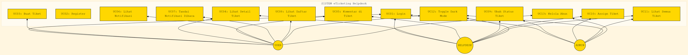

Diagram ini memperlihatkan **siapa** dapat melakukan **apa** di sistem eTicketing. Standar UML Use Case: aktor di luar, use case di dalam boundary sistem.

```
   ┌─────────────────────────────────────────────────────────────────────┐
   │                                                                     │
   │  ╔════════════════════════════════════════════════════���══════════╗  │
   │  ║  SISTEM: eTicketing Helpdesk                                  ║  │
   │  ║                                                               ║  │
   │  ║   (UC01)            (UC02)                                     ║  │
   │  ║   ┌────────┐        ┌────────┐         (UC03)                  ║  │
   │  ║   │ Login  │        │Register│         ┌────────┐               ║  │
   │  ║   └───┬────┘        └────┬───┘         │Buat    │               ║  │
   │  ║       │                  │             │Tiket   │               ║  │
   │  ║       │           ┌──────┴──────┐      └───┬────┘               ║  │
   │  ║       │           │  Reset     │          │                    ║  │
   │  ║       │           │  Password  │          │                    ║  │
   │  ║       │           └────────────┘          │                    ║  │
   │  ║       │                                   │                    ║  │
   │  ║   (UC04) ◄────────────────────────────────┘                    ║  │
   │  ║   ┌──────────────────────┐       (UC05)                         ║  │
   │  ║   │ Lihat Detail Tiket   │       ┌─────────────┐                 ║  │
   │  ║   └──────────┬───────────┘       │  Komentar   │                 ║  │
   │  ║              │                   │  di Tiket   │                 ║  │
   │  ║              │                   └──────┬──────┘                 ║  │
   │  ║              │                          │                        ║  │
   │  ║              │  ┌──────────────────────┐ │  ┌─────────────────┐ ║  │
   │  ║              │  │ Lihat Notifikasi     │◄┘  │ Tandai Semua    │ ║  │
   │  ║              │  └──────────────────────┘    │ Sudah Dibaca   │ ║  │
   │  ║              │                             └─────────────────┘ ║  │
   │  ║              │                                                    ║  │
   │  ║              │  (UC09)              (UC10)                        ║  │
   │  ║              │  ┌──────────────┐   ┌──────────────┐              ║  │
   │  ║              └─>│ Ubah Status  │   │  Assign      │              ║  │
   │  ║                 │ Tiket        │   │  Tiket ke    │              ║  │
   │  ║                 └──────────────┘   │  Diri Sendiri│              ║  │
   │  ║                                    └──────────────┘              ║  │
   │  ║                                                                   ║  │
   │  ║  ┌──────────────────────┐  ┌──────────────────────┐               ║  │
   │  ║  │ UC11: Lihat Semua    │  │ UC12: Toggle Dark   │               ║  │
   │  ║  │      Tiket           │  │      Mode           │               ║  │
   │  ║  └──────────────────────┘  └──────────────────────┘               ║  │
   │  ║                                                                   ║  │
   │  ║  ┌──────────────────────────────────────────────────┐             ║  │
   │  ║  │ UC13: Kelola Akun User (CRUD user, ubah role,    │             ║  │
   │  ║  │      aktif/nonaktif/hapus) — KHUSUS ADMIN       │             ║  │
   │  ║  └──────────────────────────────────────────────────┘             ║  │
   │  ║                                                                   ║  │
   │  ╚═══════════════════════════════════════════════════════════════════╝  │
   │                                                                     │
   └─────────────────────────────────────────────────────────────────────┘

            👤                  🛠                   👑
         (USER)              (HELPDESK)            (ADMIN)
            │                    │                   │
            │ UC01, UC02,        │ UC01 (login),     │ UC01 (login),
            │ UC03, UC04,        │ UC04, UC05,       │ UC13,
            │ UC05, UC06,        │ UC08, UC09,       │ + semua hak
            │ UC07, UC08,        │ UC10, UC11,       │ helpdesk + user
            │ UC12               │ UC12              │
            │                    │                   │
            ╰════════════════════╯                   │
                (pewarisan)                           │
                                                     │
            UC01-UC12 juga bisa ────────────────────>│
            diakses ADMIN karena                    (extends)
            inheritance penuh
```

**Daftar Use Case:**

| ID | Nama | Aktor | Tabel DB yang terlibat |
|---|---|---|---|
| UC01 | Login | Semua | `users` |
| UC02 | Register | Siapa saja | `users` (insert) |
| UC03 | Buat Tiket | User, Helpdesk | `tickets`, `ticket_history`, `notifications` |
| UC04 | Lihat Detail Tiket | Semua | `tickets`, `comments`, `ticket_history` |
| UC05 | Komentar di Tiket | Semua | `comments`, `notifications` |
| UC06 | Lihat Notifikasi | Semua | `notifications` |
| UC07 | Tandai Semua Dibaca | Semua | `notifications` (PATCH) |
| UC08 | Lihat Daftar Tiket | Semua (scope beda per role) | `tickets` |
| UC09 | Ubah Status Tiket | Helpdesk, Admin | `tickets`, `ticket_history`, `notifications` |
| UC10 | Assign Tiket ke Diri Sendiri | Helpdesk, Admin | `tickets` (UPDATE assigned_to) |
| UC11 | Lihat Semua Tiket (cross-user) | Helpdesk, Admin | `tickets` |
| UC12 | Toggle Dark Mode | Semua | (SharedPreferences, bukan DB) |
| UC13 | Kelola Akun User | Admin | `users` (CRUD penuh) |

## 2.12 Activity Diagram — Alur Lengkap "Buat Tiket → Selesai"

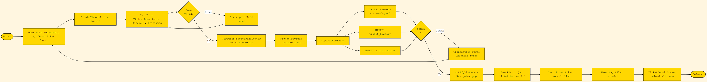

Diagram ini menunjukkan **aliran proses** lintas swimlane (aktor manusia + sistem + database). Cocok untuk menggambarkan skenario end-to-end yang kompleks.

```
   USER          │  FLUTTER UI (Client App)         │  SUPABASE POSTGREST
                 │                                  │
   ╔══════════════╪══════════════════════════════════╪══════════════════════╗
   ║              │                                  │                       ║
   ║ Buka "+"     │                                  │                       ║
   ║─────────────>│  push /tickets/new               │                       ║
   ║              │  CreateTicketScreen.initState()  │                       ║
   ║              │                                  │                       ║
   ║              │ ╔════════��════════════╗          │                       ║
   ║              │ ║  FormInputActivity  ║          │                       ║
   ║              │ ║  - judul            ║          │                       ║
   ║              │ ║  - kategori         ║          │                       ║
   ║              │ ║  - prioritas        ║          │                       ║
   ║              │ ║  - deskripsi        ║          │                       ║
   ║              │ ╚═════════════════════╝          │                       ║
   ║              │                                  │                       ║
   ║ Tap "Submit" │                                  │                       ║
   ║─────────────>│  Form.validate()                 │                       ║
   ║              │────┐                             │                       ║
   ║              │<───┘  validator: required,       │                       ║
   ║              │       length >= 5                │                       ║
   ║              │                                  │                       ║
   ║              │  Decision: valid?                │                       ║
   ║              │  ┌────[no]──── tampil error ────>│──> User (tetap di form)
   ║              │  │                               │                       ║
   ║              │  │[yes]                          │                       ║
   ║              │  │                               │                       ║
   ║              │  │ TicketProvider.createTicket() │                       ║
   ║              │  │──────────────────────────────>│                       ║
   ║              │  │                               │                       ║
   ║              │  │                          ┌────┴──── INSERT tickets (T-1729...) status='open'  ║
   ║              │  │                          │            INSERT ticket_history (status=open,     ║
   ║              │  │                          │                   note='Tiket dibuat')             ║
   ║              │  │                          │            INSERT notifications                       ║
   ║              │  │                          │                                                   ║
   ║              │  │                          │<──── 200 OK (rows affected)                        ║
   ║              │  │ reload getAllTickets()    │                                                   ║
   ║              │  │<──────────────────────────│                                                   ║
   ║              │  │ notifyListeners()         │                                                   ║
   ║              │  │──┐                        │                                                   ║
   ║              │  │<─┘ Consumer rebuild       │                                                   ║
   ║              │  │                           │                                                   ║
   ║              │  │ Navigator.pop()           │                                                   ║
   ║              │  │<──────────────            │                                                   ║
   ║              │  │ SnackBar "Tiket dibuat"   │                                                   ║
   ║<─────────────│──│──────────                 │                                                   ║
   ║ SnackBar     │  │                           │                                                   ║
   ║              │  │                           │                                                   ║
   ║  ════════════╪══╪═══════════════════════════╪═══════════════════════════════════════════════   ║
   ║              │  │   ┌─ Helpdesk buka tab Tiket ───────────────────────────────────────────┐   ║
   ║              │  │   │  refresh otomatis                                             │   ║
   ║              │  │   │<─────────────────────────────                                  │   ║
   ║              │  │   │  getAllTickets()                                               │   ║
   ║              │  │   │──────────────────────────────────────>SELECT * FROM tickets ORDER BY created_at DESC
   ║              │  │   │<──────────────────────────────────────rows (termasuk T-1729...)  ║
   ║              │  │   │                                                                  ║
   ║  ════════════╪══╪═══╪═══════════════════════════════════════════════════════════════════════════
   ║              │  │   │ Helpdesk tap kartu T-1729...                                │   ║
   ║              │  │   │  push /tickets/T-1729...                                    │   ║
   ║              │  │   │  TicketDetailScreen.initState()                             │   ║
   ║              │  │   │  TicketProvider.getTicketById()                             │   ║
   ║              │  │   │──────────────────────────────────────>SELECT * FROM tickets WHERE id=...
   ║              │  │   │                                  SELECT * FROM comments WHERE ticket_id=...
   ║              │  │   │                                  SELECT * FROM ticket_history WHERE ticket_id=...
   ║              │  │   │<──────────────────────────────────────rows
   ║              │  │   │                                                                  ║
   ║  ════════════╪══╪═══╪════════════════════════════════════════════���══════════════════════════════
   ║              │  │   │ Helpdesk tap "Ubah Status" → "inProgress"                      │   ║
   ║              │  │   │  updateTicketStatus(id, 'inProgress', note)                   │   ║
   ║              │  │   │──────────────────────────────────────>UPDATE tickets SET status='inProgress' WHERE id=...
   ║              │  │   │                                  INSERT ticket_history
   ║              │  │   │                                  INSERT notifications (untuk pembuat tiket)
   ║              │  │   │<──────────────────────────────────────200 OK
   ║              │  │   │ notifyListeners()                                                 ║
   ║              │  │   │ UI rebuild → badge status berubah → history list +1            ║
   ║  ════════════╪══╪═══╪═══════════════════════════════════════════════════════════════════════════
   ║              │  │   │ Helpdesk tap "Selesai" → status='resolved'                     │   ║
   ║              │  │   │  (sama seperti langkah sebelumnya, transisi status)
   ║              │  │   │                                                                  ║
   ║ User (pembuat)│  │   │ menerima notifikasi "Tiket T-1729... Anda Selesai"             ║
   ║ melihat tab   │  │   │ tap notif → push /tickets/T-1729... → lihat detail              ║
   ║ Notifikasi    │  │   │                                                                  ║
   ║              │  │   │ User tap "Tutup" → status='closed' (terminal)                  ║
   ╚══════════════╪══╪═══╪═══════════════════════════════════════════════════════════════════════════
```

**3 keputusan / decision point penting:**
1. Validasi form — invalid → tetap di form, valid → lanjut
2. INSERT ke 3 tabel — partial success? (saat ini pakai `await` sequential tanpa transaction wrapper, jadi jika INSERT ke-2 atau ke-3 gagal, INSERT ke-1 sudah terlanjur ter-commit. Risiko: orphan row di `tickets` / `ticket_history`)
3. Status transisi — boleh random atau harus sesuai state machine? (saat ini longgar: bebas)

## 2.13 Component Diagram (Arsitektur Komponen)

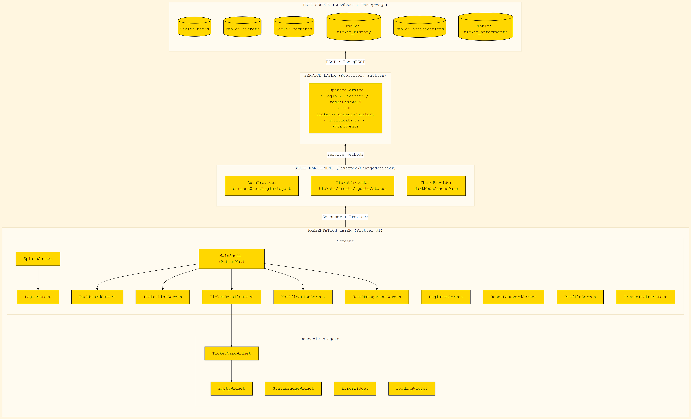

Diagram ini menunjukkan **komponen-komponen kode** dan **ketergantungan** antar-komponen. Standar untuk UAS Teori bagian "arsitektur aplikasi".

```
┌──────────────────────────────────────────────────────────────────────────────────┐
│                              LAYER PRESENTATION (UI)                             │
│                                                                                  │
│  ┌──────────────────┐  ┌──────────────────┐  ┌──────────────────┐                 │
│  │  SplashScreen    │  │  LoginScreen     │  │ RegisterScreen   │                 │
│  │  ResetPwdScreen  │  │  MainShell       │  │ ProfileScreen    │                 │
│  └────────┬─────────┘  └────────┬─────────┘  └────────┬─────────┘                 │
│           │                     │                     │                          │
│  ┌────────▼─────────────────────▼─────────────────────▼──────────────────────┐  │
│  │           DashboardScreen  TicketListScreen  CreateTicketScreen              │  │
│  │           TicketDetailScreen  NotificationScreen  UserManagementScreen      │  │
│  └────────┬───────────────────────────────────────────────────────────────────┘  │
│           │                                                                      │
│  ┌────────▼─────────┐  ┌─────────────────┐  ┌──────────────────┐                 │
│  │  TicketCard      │  │  StatusBadge    │  │  Empty/Error/    │                 │
│  │  Widget          │  │  Widget         │  │  LoadingWidget   │                 │
│  └──────────────────┘  └─────────────────┘  └──────────────────┘                 │
└──────────────────────────────┬───────────────────────────────────────────────────┘
                               │ Consumer<T> + context.read<T>()
                               ▼
┌──────────────────────────────────────────────────────────────────────────────────┐
│                            LAYER STATE MANAGEMENT                                │
│                                                                                  │
│  ┌──────────────────────┐  ┌──────────────────────┐  ┌──────────────────────┐    │
│  │   AuthProvider       │  │  TicketProvider      │  │  ThemeProvider       │    │
│  │   (ChangeNotifier)   │  │  (ChangeNotifier)    │  │  (ChangeNotifier)    │    │
│  │                      │  │                      │  │                      │    │
│  │  - login()           │  │  - getAllTickets()   │  │  - toggleTheme()     │    │
│  │  - register()        │  │  - getTicketById()   │  │  - loadFromPrefs()   │    │
│  │  - logout()          │  │  - createTicket()    │  │                      │    │
│  │  - currentUser       │  │  - updateStatus()    │  │                      │    │
│  │                      │  │  - getComments()     │  │                      │    │
│  │                      │  │  - addComment()      │  │                      │    │
│  │                      │  │  - getNotifications()│  │                      │    │
│  └──────────┬───────────┘  └──────────┬───────────┘  └──────────┬───────────┘    │
└─────────────┼─────────────────────────┼────────────────────────┼─────────────────┘
              │                         │                        │
              │      ┌──────────────────┘                        │
              │      │                                           │
              ▼      ▼                                           ▼
┌──────────────────────────────────────────────────────────────────────────────────┐
│                              LAYER SERVICE                                        │
│                                                                                  │
│       ┌──────────────────────────────────────────────────────────┐               │
│       │            SupabaseService  (singleton)                  │               │
│       │                                                          │               │
│       │   Auth API           Ticket API       Comment API        │               │
│       │   - login()          - getAll()       - getForTicket()  │               │
│       │   - register()       - getById()      - add()           │               │
│       │   - getByEmail()     - create()                         │               │
│       │                      - updateStatus()                   │               │
│       │   User API           - assign()                         │               │
│       │   - getAllUsers()    History API      Notif API         │               │
│       │   - createUser()     - add()           - getAll()        │               │
│       │   - updateRole()     - getForTicket()  - markAllRead()   │               │
│       │   - toggleActive()                                     │               │
│       │   - deleteUser()                                        │               │
│       └──────────────────────────┬───────────────────────────────┘               │
└──────────────────────────────────┼──────────────────────────────────────────────┘
                                   │ https://xxx.supabase.co/rest/v1
                                   │ Authorization: Bearer <anon-key>
                                   ▼
┌───────────��──────────────────────────────────────────────────────────────────────┐
│                       LAYER DATA (Supabase Postgres)                              │
│                                                                                  │
│   ┌────────────┐   ┌────────────┐   ┌──────────────┐   ┌──────────────────┐     │
│   │  users     │   │  tickets   │   │  comments    │   │  ticket_history  │     │
│   └────────────┘   └────────────┘   └──────────────┘   └──────────────────┘     │
│   ┌────────────┐   ┌──────────────────┐                                           │
│   │  notifs    │   │  attachments     │                                           │
│   └────────────┘   └──────────────────┘                                           │
└──────────────────────────────────────────────────────────────────────────────────┘
```

**Prinsip arsitektur:**
- **Satu arah** (top-down): UI → Provider → Service → DB
- **Provider** tidak tahu UI (tidak ada `BuildContext` di provider)
- **Service** tidak tahu Provider (return `Future<T>` atau `null`)
- **Model** adalah data class plain (no business logic) — lihat `lib/data/models/`
- **Routing** lewat GoRouter (di `lib/core/router/app_router.dart`), bukan `Navigator.push`
