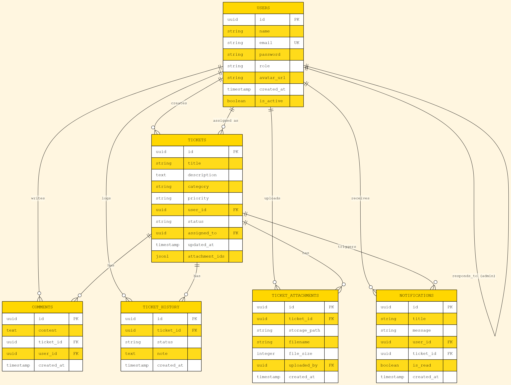

# 03 — Database

## 3.1 Platform

**Supabase** (Postgres 15) — cloud-hosted. Project ref: `eblilamcydtnafqhzcxa`.
URL region: Asia (Singapore). Akses via:
- **Supabase Dashboard:** https://supabase.com/dashboard/project/eblilamcydtnafqhzcxa
- **Anon key (publik):** ada di `lib/core/supabase_config.dart` (Flutter side, tidak perlu auth user untuk read karena RLS di-disable untuk dev).

Database ini menyimpan **6 tabel utama** untuk eTicketing Helpdesk: data user, tiket, komentar, history, notifikasi, dan attachment. Total estimasi rows untuk development < 1.000 (5 user, 6 tiket demo).

## 3.2 Daftar Tabel

| # | Tabel | Fungsi | Estimasi Rows |
|---|---|---|---|
| 1 | `users` | Akun pengguna + role | < 1.000 |
| 2 | `tickets` | Laporan tiket | < 10.000 |
| 3 | `comments` | Komentar di tiket | < 100.000 |
| 4 | `ticket_history` | Audit trail perubahan status | < 50.000 |
| 5 | `notifications` | Notifikasi in-app | < 50.000 |
| 6 | `ticket_attachments` | File attachment URL | < 10.000 |

**Konvensi ID Tiket** (penting karena field ini TEXT, bukan UUID):

- **Seed data** (di `database_setup.sql`): pakai format `TK-001`, `TK-002`, ... `TK-006` — mudah dibaca manusia.
- **Runtime** (di `lib/presentation/providers/ticket_provider.dart:86`): saat user membuat tiket baru, ID di-generate sebagai `'T-${DateTime.now().millisecondsSinceEpoch}'`, contoh: `T-1720234567890` — unik berbasis timestamp, anti-duplikat walau tanpa UUID generator.

Kedua format valid; yang penting konsisten saat query.

## 3.3 Skema Lengkap (sesuai `database_setup.sql`)

```sql
-- ── 1. USERS ──────────────────────────────────────────────────────────
CREATE TABLE IF NOT EXISTS users (
  id          UUID         PRIMARY KEY,
  name        TEXT         NOT NULL,
  email       TEXT         NOT NULL UNIQUE,
  password    TEXT         NOT NULL,                -- plain text (untuk demo UAS)
  role        TEXT         NOT NULL CHECK (role IN ('user', 'helpdesk', 'admin')),
  avatar_url  TEXT,
  created_at  TIMESTAMPTZ  NOT NULL DEFAULT NOW(),
  is_active   BOOLEAN      DEFAULT TRUE            -- soft-delete flag
);

-- ── 2. TICKETS ────────────────────────────────────────────────────────
CREATE TABLE IF NOT EXISTS tickets (
  id           TEXT         PRIMARY KEY,           -- "TK-001" (seed) atau "T-1720..." (runtime)
  title        TEXT         NOT NULL,
  description  TEXT,
  category     TEXT         NOT NULL CHECK (category IN ('hardware', 'software', 'network', 'other')),
  priority     TEXT         NOT NULL CHECK (priority IN ('low', 'medium', 'high')),
  status       TEXT         NOT NULL DEFAULT 'open'
                            CHECK (status IN ('open', 'inProgress', 'resolved', 'closed')),
  created_by   UUID         NOT NULL REFERENCES users(id),
  assigned_to  UUID         REFERENCES users(id),  -- nullable: belum di-claim helpdesk
  created_at   TIMESTAMPTZ  NOT NULL DEFAULT NOW(),
  updated_at   TIMESTAMPTZ  NOT NULL DEFAULT NOW()
);

-- ── 3. COMMENTS ───────────────────────────────────────────────────────
CREATE TABLE IF NOT EXISTS comments (
  id          TEXT         PRIMARY KEY,            -- "cm-01" (seed) atau "cm-<uuid>" (runtime)
  ticket_id   TEXT         NOT NULL REFERENCES tickets(id) ON DELETE CASCADE,
  user_id     UUID         NOT NULL REFERENCES users(id),
  user_name   TEXT         NOT NULL,               -- snapshot nama, biar cepat
  content     TEXT         NOT NULL,
  created_at  TIMESTAMPTZ  NOT NULL DEFAULT NOW()
);

-- ── 4. TICKET HISTORY ─────────────────────────────────────────────────
CREATE TABLE IF NOT EXISTS ticket_history (
  id          UUID         PRIMARY KEY DEFAULT gen_random_uuid(),
  ticket_id   TEXT         NOT NULL REFERENCES tickets(id) ON DELETE CASCADE,
  status      TEXT         NOT NULL,
  changed_at  TIMESTAMPTZ  NOT NULL DEFAULT NOW(),
  note        TEXT
);

-- ── 5. NOTIFICATIONS ──────────────────────────────────────────────────
CREATE TABLE IF NOT EXISTS notifications (
  id          TEXT         PRIMARY KEY,            -- "nf-01" (seed) atau "nf-<uuid>" (runtime)
  title       TEXT         NOT NULL,
  message     TEXT         NOT NULL,
  ticket_id   TEXT         REFERENCES tickets(id), -- nullable: notif sistem boleh tanpa tiket
  is_read     BOOLEAN      NOT NULL DEFAULT FALSE,
  created_at  TIMESTAMPTZ  NOT NULL DEFAULT NOW()
);

-- ── 6. ATTACHMENTS ────────────────────────────────────────────────────
CREATE TABLE IF NOT EXISTS ticket_attachments (
  id          UUID         PRIMARY KEY DEFAULT gen_random_uuid(),
  ticket_id   TEXT         NOT NULL REFERENCES tickets(id) ON DELETE CASCADE,
  file_url    TEXT         NOT NULL,
  file_name   TEXT,
  created_at  TIMESTAMPTZ  NOT NULL DEFAULT NOW()
);
```

**Catatan penting dari kode Flutter (sinkronisasi field):**

| Field Dart | Field DB | Tipe Dart | Tipe DB | Konversi |
|---|---|---|---|---|
| `TicketModel.id` | `tickets.id` | `String` | `TEXT` | langsung |
| `TicketModel.createdBy` | `tickets.created_by` | `String` | `UUID` | String berisi UUID |
| `TicketModel.assignedTo` | `tickets.assigned_to` | `String?` | `UUID NULL` | String berisi UUID atau `null` |
| `TicketModel.category` | `tickets.category` | `TicketCategory` enum | `TEXT` | `enum.name` (lowercase) |
| `TicketModel.priority` | `tickets.priority` | `TicketPriority` enum | `TEXT` | `enum.name` |
| `TicketModel.status` | `tickets.status` | `TicketStatus` enum | `TEXT` | `enum.name` (camelCase: `inProgress`) |
| `TicketModel.createdAt` | `tickets.created_at` | `DateTime` | `TIMESTAMPTZ` | ISO-8601 string |

Enum di Dart (lihat `lib/data/models/ticket_model.dart`):
```dart
enum TicketStatus   { open, inProgress, resolved, closed }
enum TicketPriority { low, medium, high }
enum TicketCategory { hardware, software, network, other }
```

## 3.4 ERD (Entity Relationship Diagram)



```
                         ┌──────────────────────────────────────┐
                         │              USERS                   │
                         │──────────────────────────────────────│
                         │ PK  id           : UUID              │
                         │     name         : TEXT (NOT NULL)   │
                         │ UK  email        : TEXT (NOT NULL)   │
                         │     password     : TEXT (NOT NULL)   │
                         │     role         : TEXT  CHECK IN    │
                         │       ('user', 'helpdesk', 'admin') │
                         │     avatar_url   : TEXT              │
                         │     created_at   : TIMESTAMPTZ       │
                         │     is_active    : BOOLEAN           │
                         └──────┬────────────────┬─────────────┘
                                │                │
                  creates 1:N   │                │  is_assigned 1:N
                                │                │  (nullable)
                                ▼                ▼
        ┌──────────────────────────────────────────────────┐
        │                       TICKETS                     │
        │──────────────────────────────────────────────────│
        │ PK  id          : TEXT                            │
        │     (contoh: "TK-001" seed atau "T-1720…" runtime)│
        │     title       : TEXT (NOT NULL)                │
        │     description : TEXT                           │
        │     category    : TEXT  CHECK IN (hardware,      │
        │                               software, network, │
        │                               other)              │
        │     priority    : TEXT  CHECK IN (low,med,high)  │
        │     status      : TEXT  DEFAULT 'open'           │
        │                          CHECK IN (open,         │
        │                            inProgress, resolved, │
        │                            closed)               │
        │ FK  created_by  : UUID  → users.id  (NOT NULL)   │
        │ FK  assigned_to : UUID  → users.id  (nullable)   │
        │     created_at  : TIMESTAMPTZ                    │
        │     updated_at  : TIMESTAMPTZ                    │
        └───┬─────────────┬─────────────┬─────────────┬───┘
            │             │             │             │
            │ has 1:N      │ has 1:N     │ has 1:N     │ has 1:N
            │ (CASCADE)    │ (CASCADE)   │ (nullable   │ (CASCADE)
            ▼              ▼             │  no cascade) ▼
  ┌──────────────┐ ┌───────────────┐  │            ┌──────────────┐
  │   COMMENTS   │ │ TICKET_HISTORY│  │            │TICKET_       │
  │──────────────│ │───────────────│  │            │ ATTACHMENTS  │
  │PK id  : TEXT │ │PK id  : UUID  │  │            │──────────────│
  │FK ticket_id  │ │FK ticket_id   │  │            │PK id  : UUID │
  │FK user_id    │ │   status: TEXT│  │            │FK ticket_id  │
  │user_name TEXT│ │   note  : TEXT│  │            │   file_url   │
  │content TEXT  │ │   changed_at  │  ▼            │   file_name  │
  │created_at    │ │   : TIMESTAMP│┌─────────────┐│   created_at │
  └──────────────┘ └───────────────┘│ NOTIFICATIONS│└──────────────┘
                                   │──────────────│
                                   │PK id  : TEXT │
                                   │FK ticket_id  │
                                   │   (nullable) │
                                   │   title: TEXT│
                                   │   message    │
                                   │   is_read    │
                                   │   created_at │
                                   └──────────────┘
```

**Cardinalitas ringkas (FK behavior di Supabase):**

| Relasi | Tipe | Cascade | Catatan |
|---|---|---|---|
| `users → tickets` (created_by) | One-to-Many (mandatory) | (tidak ada) | Setiap tiket **wajib** punya pembuat |
| `users → tickets` (assigned_to) | One-to-Many (optional) | (tidak ada) | Nullable sampai helpdesk claim |
| `users → comments` | One-to-Many | (tidak ada) | Komentar linked ke user author |
| `tickets → comments` | One-to-Many | **CASCADE** | Hapus tiket → komentar hilang |
| `tickets → ticket_history` | One-to-Many | **CASCADE** | Audit trail hilang bersama tiket |
| `tickets → notifications` | One-to-Many (nullable) | (tidak ada) | Notif sistem boleh tanpa ticket_id |
| `tickets → ticket_attachments` | One-to-Many | **CASCADE** | File hilang bersama tiket |

## 3.5 Relasi Kunci (Foreign Key Detail)

| Constraint | Tipe | ON DELETE | ON UPDATE |
|---|---|---|---|
| `tickets.created_by → users.id` | Many-to-One (mandatory) | (default RESTRICT) | CASCADE (default) |
| `tickets.assigned_to → users.id` | Many-to-One (optional) | SET NULL (bisa) | CASCADE |
| `comments.ticket_id → tickets.id` | Many-to-One | **CASCADE** | CASCADE |
| `comments.user_id → users.id` | Many-to-One (mandatory) | (default RESTRICT) | CASCADE |
| `ticket_history.ticket_id → tickets.id` | Many-to-One | **CASCADE** | CASCADE |
| `notifications.ticket_id → tickets.id` | Many-to-One (optional) | SET NULL | CASCADE |
| `ticket_attachments.ticket_id → tickets.id` | Many-to-One | **CASCADE** | CASCADE |

> Semua FK constraint ada di tabel **children**; parent (`users`, `tickets`) tidak punya FK keluar.

## 3.6 Data Riil (Hasil Seed)

Hasil eksekusi `database_setup.sql` di Supabase project `eblilamcydtnafqhzcxa`:

**Tabel `users` (5 baris):**

| id (UUID) | email | role | name | is_active |
|---|---|---|---|---|
| `a0000000-…-0001` | irsad@email.com | user | Irsad Gufar | true |
| `a0000000-…-0002` | azzam@email.com | user | Abdullah Azzam | true |
| `a0000000-…-0003` | rafael@email.com | helpdesk | rafael Anandi | true |
| `a0000000-…-0004` | dewi@email.com | helpdesk | Dewi Chumairoh | true |
| `a0000000-…-0005` | admin@email.com | admin | Admin | true |

**Tabel `tickets` (6 baris):**

| id | title | category | priority | status | created_by | assigned_to |
|---|---|---|---|---|---|---|
| `TK-001` | Laptop sering hang saat buka banyak aplikasi | hardware | high | inProgress | irsad (…0001) | rafael (…0003) |
| `TK-002` | Tidak bisa print ke printer kantor lantai 3 | software | medium | open | azzam (…0002) | NULL |
| `TK-003` | WiFi drop setiap jam 10 pagi | network | high | resolved | irsad (…0001) | dewi (…0004) |
| `TK-004` | Access VPN tidak bisa login | network | high | inProgress | azzam (…0002) | rafael (…0003) |
| `TK-005` | Install Office 365 untuk kerja jarak jauh | software | low | closed | irsad (…0001) | rafael (…0003) |
| `TK-006` | Monitor LCD rusak pixel mati | hardware | medium | open | azzam (…0002) | NULL |

**Tabel `comments` (3 baris):** `cm-01` (TK-001 oleh rafael), `cm-02` (TK-003 oleh Dewi), `cm-03` (TK-005 oleh rafael).

> **Catatan:** Nama `user_name` pada kolom `comments` adalah **snapshot** ketika komentar ditulis — tidak ikut berubah saat user di-rename. Pada seed awal, snapshot nama ditulis `'Rizky Pratama'` dan `'Dewi Lestari'` (nama lama akun helpdesk) dan **dipertahankan apa adanya** di `database_setup.sql` untuk menjaga konsistensi historis komentar. Ini disengaja untuk mendemonstrasikan sifat denormalisasi kolom `user_name` (lihat 3.5). Akun helpdesk di tabel `users` sendiri sudah di-update ke nama baru (`rafael Anandi`, `Dewi Chumairoh`).

**Tabel `ticket_history` (11 baris):** mencakup semua transisi status tiket TK-001 sampai TK-006 (lihat 3.10 untuk state machine).

**Tabel `notifications` (5 baris):** `nf-01..nf-05` — mix `is_read=true/false`.

**Tabel `ticket_attachments` (0 baris):** kosong di seed, akan terisi saat runtime upload.

## 3.7 Contoh Query (Pakai Field Aktual)

Query ini semuanya benar-benar dipakai oleh `SupabaseService` di Dart code:

**1. Login — cari user by email + password:**
```dart
final response = await _supabase
    .from('users')
    .select()
    .eq('email', email)
    .eq('password', password)
    .eq('is_active', true)
    .maybeSingle();
```

**2. Ambil semua tiket + comments + history (eager loading):**
```dart
final response = await _supabase
    .from('tickets')
    .select('''
      *,
      comments(*),
      ticket_history(*),
      ticket_attachments(*)
    ''')
    .order('updated_at', ascending: false);
```

**3. Filter tiket by status + role-aware:**
```dart
// Untuk user biasa — tiket sendiri
if (role == 'user') {
  query = query.eq('created_by', currentUserId);
}
// Untuk helpdesk/admin — semua tiket
// (tidak ada filter)
final tickets = await query.order('updated_at', ascending: false);
```

**4. Insert tiket baru + history + notification (3 query terpisah, bukan transaction):**
```dart
final newId = 'T-${DateTime.now().millisecondsSinceEpoch}';
await _supabase.from('tickets').insert({
  'id': newId,
  'title': title,
  'description': description,
  'category': category.name,
  'priority': priority.name,
  'status': 'open',
  'created_by': currentUserId,
});
await _supabase.from('ticket_history').insert({
  'ticket_id': newId,
  'status': 'open',
  'note': 'Tiket dibuat',
});
await _supabase.from('notifications').insert({
  'id': 'nf-${DateTime.now().millisecondsSinceEpoch}',
  'title': 'Tiket Baru',
  'message': '$title',
  'ticket_id': newId,
  'is_read': false,
});
```

**5. Update status tiket:**
```dart
await _supabase.from('tickets').update({
  'status': newStatus.name,
  'updated_at': DateTime.now().toIso8601String(),
}).eq('id', ticketId);

await _supabase.from('ticket_history').insert({
  'ticket_id': ticketId,
  'status': newStatus.name,
  'note': note,
});
```

**6. Tandai notifikasi sudah dibaca:**
```dart
await _supabase
    .from('notifications')
    .update({'is_read': true})
    .eq('id', notificationId);
```

**7. Tandai semua notifikasi sudah dibaca (bulk):**
```dart
await _supabase
    .from('notifications')
    .update({'is_read': true})
    .eq('is_read', false);
```

## 3.8 Indexes

Untuk produksi (data membesar), tambahkan index berikut. Saat ini seed data < 100 baris sehingga index belum dibuat (overhead tidak sebanding):

```sql
CREATE INDEX idx_tickets_created_by  ON tickets(created_by);
CREATE INDEX idx_tickets_assigned_to ON tickets(assigned_to);
CREATE INDEX idx_tickets_status      ON tickets(status);
CREATE INDEX idx_tickets_created_at  ON tickets(created_at DESC);
CREATE INDEX idx_comments_ticket_id  ON comments(ticket_id);
CREATE INDEX idx_history_ticket_id   ON ticket_history(ticket_id);
CREATE INDEX idx_notifications_created_at ON notifications(created_at DESC);
CREATE INDEX idx_notifications_unread     ON notifications(is_read) WHERE is_read = FALSE;
```

## 3.9 Row Level Security (RLS)

**Status saat ini: DISABLED** untuk semua tabel. SQL disable ada di baris akhir `database_setup.sql`. Alasan: proyek UAS, tidak ada multi-tenant, dan supaya query PostgREST publik dari anon-key tetap jalan untuk development.

```sql
ALTER TABLE users              DISABLE ROW LEVEL SECURITY;
ALTER TABLE tickets            DISABLE ROW LEVEL SECURITY;
ALTER TABLE comments           DISABLE ROW LEVEL SECURITY;
ALTER TABLE ticket_history     DISABLE ROW LEVEL SECURITY;
ALTER TABLE notifications      DISABLE ROW LEVEL SECURITY;
ALTER TABLE ticket_attachments DISABLE ROW LEVEL SECURITY;
```

**Rencana RLS untuk production (siap diterapkan saat deploy beneran):**

```sql
-- Aktifkan RLS
ALTER TABLE tickets ENABLE ROW LEVEL SECURITY;

-- User biasa hanya bisa lihat tiket sendiri
CREATE POLICY "user_view_own_tickets" ON tickets FOR SELECT
USING (
  created_by = auth.uid()
  OR (auth.jwt() ->> 'role') IN ('admin','helpdesk')
);

-- Helpdesk + admin boleh update status
CREATE POLICY "helpdesk_update_tickets" ON tickets FOR UPDATE
USING ((auth.jwt() ->> 'role') IN ('helpdesk','admin'));

-- Hanya admin boleh delete
CREATE POLICY "admin_delete_tickets" ON tickets FOR DELETE
USING ((auth.jwt() ->> 'role') = 'admin');
```

## 3.10 State Machine Lifecycle (Tiap Transisi Status)

```
                       ┌──────────────────────────────────────────────┐
                       │         STATE MACHINE: TICKET STATUS         │
                       └──────────────────────────────────────────────┘

   ┌──────────┐  Helpdesk "Mulai Kerjakan"   ┌──────────────┐
   │  (start) │─────────────────────────────>│              │
   └──────────┘                              │              │
        │                                   │   inProgress │
        │ User buat tiket                   │              │
        │ INSERT tickets status='open'      │              │
        │ INSERT ticket_history             └──────┬───────┘
        │ INSERT notifications                     │
        ▼                                          │
   ┌──────────┐                                    │
   │          │──── Helpdesk "Kembalikan" ─────────┘
   │   open   │              │
   │          │              ▼
   │          │         ┌──────────┐  Helpdesk "Selesai"   ┌──────────┐
   └──────────┘         │          │────────────────────> │          │
                        │ resolved │                       │  closed  │
                        │          │<──── Re-open ──────── │          │
                        └──────────┘                       └────┬─────┘
                            ▲                                   │
                            │                                   │ Tiket final
                            │ User/Helpdesk "Tutup"             │ (read-only)
                            └───────────────────────────────────┘
                                                                │
                                                                ▼
                                                          ┌──────────┐
                                                          │  (end)   │
                                                          └──────────┘
```

**Side effect setiap transisi (3 INSERT/UPDATE):**

| Transisi | Trigger UI | DB Operation |
|---|---|---|
| `[*] → open` | User tap "SUBMIT" di CreateTicketScreen | INSERT `tickets` + INSERT `ticket_history(status='open', note='Tiket dibuat')` + INSERT `notifications` |
| `open → inProgress` | Helpdesk tap "Mulai Kerjakan" di TicketDetail | UPDATE `tickets.status` + INSERT `ticket_history(status='inProgress', note='...')` + INSERT `notifications` |
| `inProgress → resolved` | Helpdesk tap "Selesaikan" | UPDATE + INSERT history + INSERT notif ke pembuat tiket |
| `resolved → closed` | User/Helpdesk tap "Tutup" | UPDATE + INSERT history |
| `inProgress → open` | Helpdesk tap "Kembalikan" | UPDATE + INSERT history + INSERT notif |
| `resolved → inProgress` | Re-open (butuh kerja ulang) | UPDATE + INSERT history |
| `closed → [*]` | — | **Hard stop**, read-only, tidak ada perubahan DB |

**Invarian:** kolom `tickets.status` SELALU bernilai satu dari {`open`, `inProgress`, `resolved`, `closed`} — dijamin oleh CHECK constraint di level DB.

**Contoh konkret di seed (TK-005 lifecycle):**
```
[TK-005] created   (2026-07-01 10:00)  status=open
[TK-005] resolved  (2026-07-03 11:00)  note='Office 365 terinstall'
[TK-005] closed    (2026-07-03 15:00)  note='Tiket ditutup'
```

## 3.11 Storage Bucket

Ada 1 bucket Supabase Storage: `attachments` (public read). Dipakai oleh `SupabaseService.uploadAttachment()`.

```
attachments/
├── T-1720234567890/                       # folder per-tiket
│   ├── 1717800000_foto_laptop.jpg
│   └── 1717800100_log_error.txt
├── TK-001/
│   └── 1720000000_screenshot_error.png
└── TK-004/
    └── 1720000100_vpn_log.txt
```

**Ukuran file max default Supabase: 50 MB per file** (cukup untuk kebanyakan kebutuhan helpdesk — screenshot, log, foto).
**Tipe file yang diizinkan:** bebas (tidak ada filter extension di level bucket).

URL public hasil upload: `https://eblilamcydtnafqhzcxa.supabase.co/storage/v1/object/public/attachments/T-1720234567890/1717800000_foto_laptop.jpg`

URL ini disimpan di kolom `file_url` tabel `ticket_attachments`.
